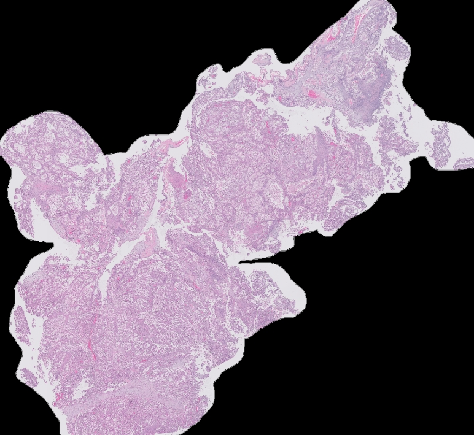
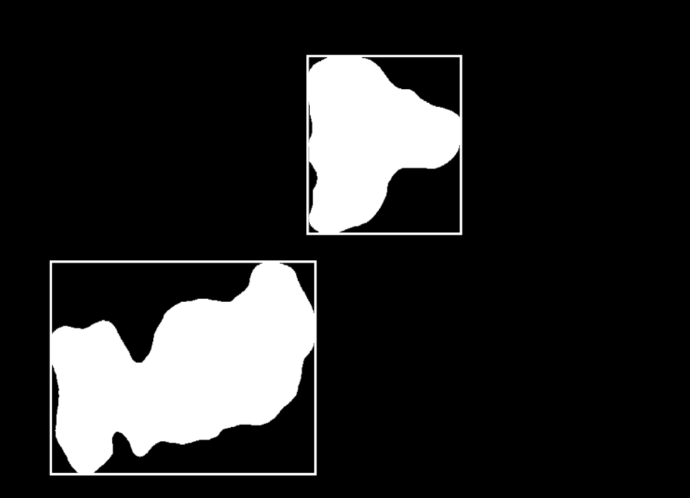
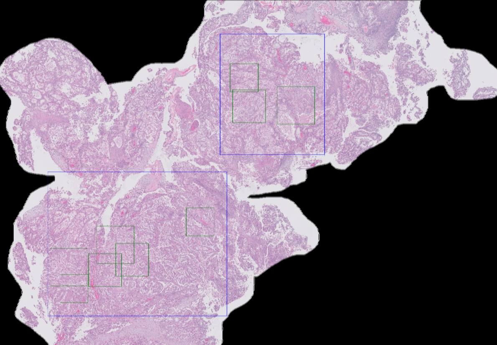
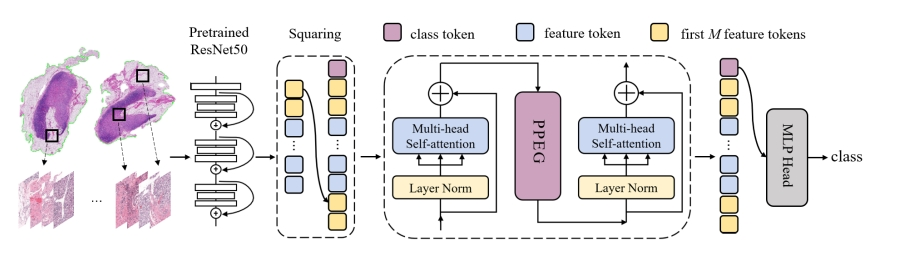
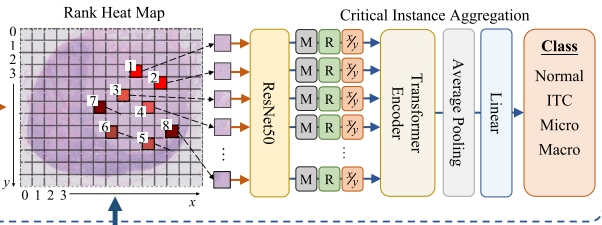

# kaggle_UBC_ocean的卵巢癌组织病理学图像分类的MIL多实例学习代码

比赛链接：[kaggle_UBC_ocean](https://www.kaggle.com/competitions/UBC-OCEAN)

本项目提供了对如60000px分辨率大的WSI图像进行高概率癌变区域分类的方法：
使用赛方提供的236张mask掩码缩放至缩略图大小，而后使用`train_thumbnails`的WSI缩略图图像进行`U_net`分割网络训练和后得到的分割模型效果如下：

- 其中对于图像 `train_images/22489.png`：



  使用 `U_net` 进行分割后，得到如下掩码：



  对以上掩码选出最小的能够包裹分割区域的几块正方形，而后进行坐标缩放转换，在对WSI原图对应位置进行裁剪，如下图：



  蓝色线条为包裹分割的癌变区域的最小方块，而后在蓝色的每个方块里进行`1000*1000px`的随机裁剪如绿色方框，裁剪后的图像送入CNN做高概率病变区域的多实例分类。

使用论文 `TransMIL` 的技术：先用 `cnn提取` 特征，而后每张图的特征图转换为单个 `token` 而后送入 `transformer` 的 `encoder` 进行多实例学习。

流程图如下：



- 论文链接：[arxiv.org/abs/2106.00908](https://arxiv.org/abs/2106.00908)

此技术比 `TransMIL` 多了图像分割部分，所以更适合计算资源， 提高分类正确率。

流程图如下：



获得高分类高分区图由CNN提取特征，而后展平作为序列送入`transformer`进行多实例学习。

代码环境为`kaggle`比赛运行环境，代码使用.ipynb格式。

环境可如下配置：
```bash
pip install -r requirements.txt
