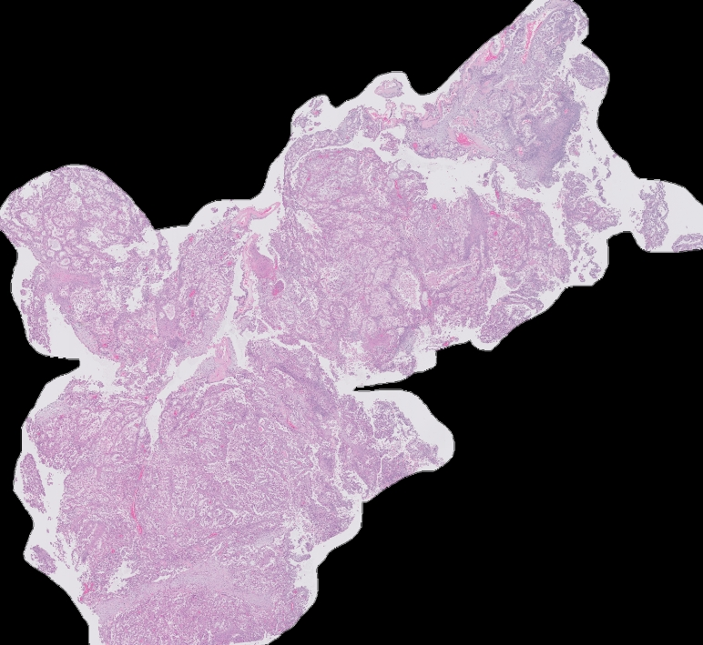
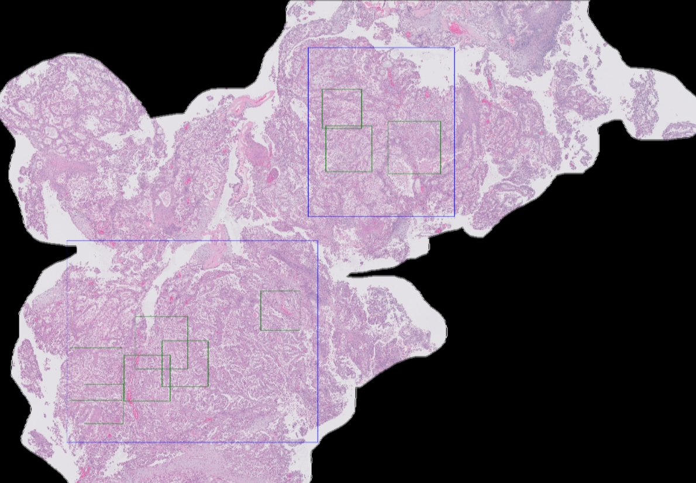
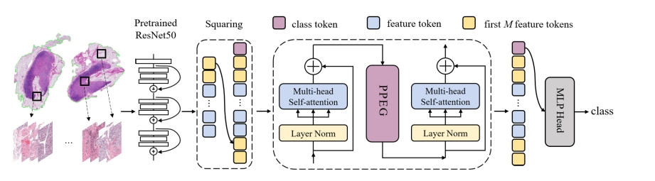
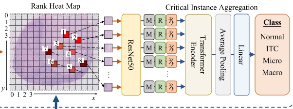

# MIL-Based Multi-Instance Learning Code for Ovarian Cancer Histopathology Image Classification from kaggle_UBC_ocean

**Language:** [中文](readme.md)

Competition Link: [kaggle_UBC_ocean](https://www.kaggle.com/competitions/UBC-OCEAN)

This project provides a method for classifying high-probability cancerous regions in high-resolution WSI images (up to 60000px):
The 236 mask images provided by the competition organizers are scaled down to thumbnail size, and then the `U_net` segmentation network is trained using the WSI thumbnails in `train_thumbnails`. The segmentation model results are as follows:

- For the image `train_images/22489.png`:



  After segmentation using `U_net`, the mask is as follows:


  From the above mask, the smallest squares that can enclose the segmented regions are selected, and then coordinate scaling and transformation are performed to crop the corresponding positions in the original WSI image, as shown below:



  The blue boxes represent the smallest squares that enclose the cancerous regions, and within each blue box, `1000*1000px` random crops are performed as shown in the green squares. The cropped images are then sent to CNN for multi-instance classification of high-probability cancerous regions.

Using the technique from the paper `TransMIL`: First, extract features using `cnn`, then convert the feature map of each image into a single `token`, and send it to the `encoder` of the `transformer` for multi-instance learning.

The workflow is as follows:



- Paper Link: [arxiv.org/abs/2106.00908](https://arxiv.org/abs/2106.00908)

This technique includes an image segmentation part compared to `TransMIL`, which reduces computational resources and improves classification accuracy.

The workflow is as follows:



After obtaining high-probability disease regions, CNN is used to extract features, which are then flattened and sent as sequences to the transformer for multi-instance learning. The code environment is the `kaggle` competition environment, and the code is in `.ipynb` format.

The environment can be configured as follows:
```bash
pip install -r requirements.txt
